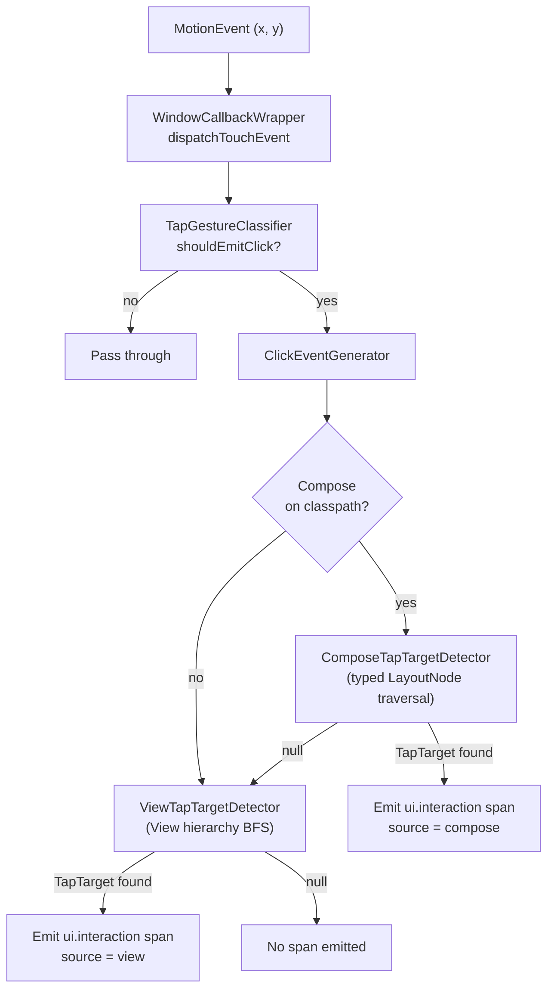
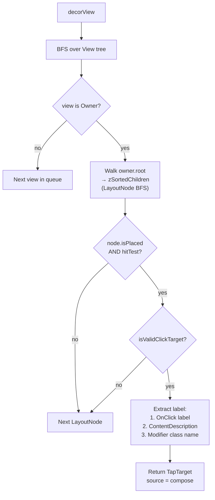
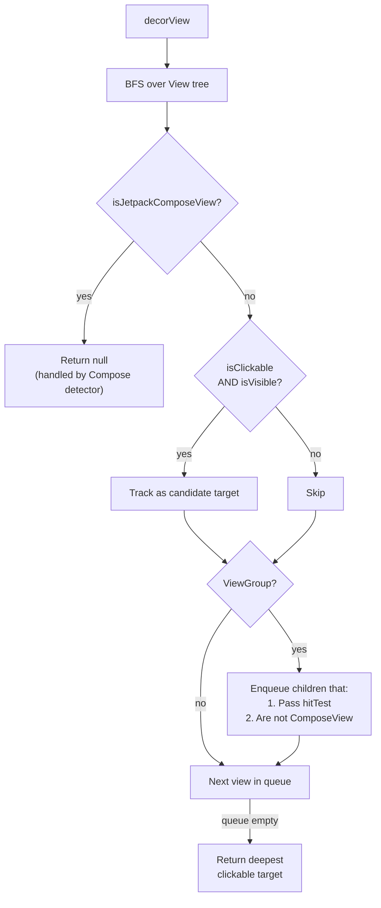

# hybrid-click — Design Document

**Author:** Ashish Zingade

## Purpose

`hybrid-click` captures tap/click interactions from Android apps that use **View-based UI**,
**Jetpack Compose UI**, or **both** within the same screen. Each qualified tap produces a single
OpenTelemetry `ui.interaction` span with metadata identifying the tapped widget and which UI framework
rendered it.

This is distinct from the `view-click` and `compose-click` modules, which each handle only
one framework. `hybrid-click` combines both detection paths behind a single instrumentation
entry point.

---

## Architecture Overview

```
┌──────────────────────────────────────────────────────────────────┐
│                    HybridClickInstrumentation                    │
│               (AutoService entry point, installs on app start)   │
│                                                                  │
│  Registers ClickActivityCallback with Application lifecycle      │
└──────────────────────┬───────────────────────────────────────────┘
                       │
                       ▼
┌──────────────────────────────────────────────────────────────────┐
│                    ClickActivityCallback                         │
│                                                                  │
│  onActivityResumed → ClickEventGenerator.startTracking(window)   │
│  onActivityPaused  → ClickEventGenerator.stopTracking()          │
└──────────────────────┬───────────────────────────────────────────┘
                       │
                       ▼
┌──────────────────────────────────────────────────────────────────┐
│                    WindowCallbackWrapper                          │
│                                                                  │
│  Wraps Window.Callback via delegation                            │
│  dispatchTouchEvent → ClickEventGenerator.generateClick(event)   │
│                       then delegates to original callback        │
└──────────────────────┬───────────────────────────────────────────┘
                       │
                       ▼
┌──────────────────────────────────────────────────────────────────┐
│                    ClickEventGenerator (orchestrator)             │
│                                                                  │
│  1. TapGestureClassifier gates non-tap gestures                  │
│  2. Compose detector first (if Compose on classpath)             │
│  3. View detector as fallback                                    │
│  4. Emit ui.interaction span with attributes                           │
└──────────────────────────────────────────────────────────────────┘
```

---

## Runtime Flow



**Key decision**: Compose is always tried first. If the tap lands on a Compose surface
(`AndroidComposeView` / `Owner`), it returns a `TapTarget` immediately. If Compose is not
present or returns `null`, the View detector takes over. This ensures no double-counting
when a `ComposeView` is embedded inside a View hierarchy.

---

## Module Structure

```
hybrid-click/src/main/kotlin/.../hybrid/click/
│
├── HybridClickInstrumentation.kt    Entry point (AutoService)
├── ClickActivityCallback.kt         Activity lifecycle → window tracking
├── ClickEventGenerator.kt           Orchestrator: classify → detect → emit
├── WindowCallbackWrapper.kt         Touch event interception
│
├── compose/
│   ├── ComposeTapTargetDetector.kt   Typed LayoutNode/Owner traversal
│   └── ComposeLayoutNodeUtil.kt      Bounds & position from LayoutNode
│
├── view/
│   └── ViewTapTargetDetector.kt      View hierarchy BFS traversal
│
└── shared/
    ├── TapTarget.kt                  Normalized click target data
    ├── TapGestureClassifier.kt       Down→Move→Up tap detection
    ├── LabelResolver.kt              Best-effort display label resolution
    └── SemConvConstants.kt           OpenTelemetry attribute keys
```

---

## Compose Detection Path



### Compose Internals Access

The Compose detector uses `@file:Suppress("INVISIBLE_MEMBER", "INVISIBLE_REFERENCE")` to
access internal Compose APIs (`LayoutNode`, `Owner`, `SemanticsModifier`, etc.). This is the
same pattern used by the `compose-click` module. Classes are annotated with `@RequiresApi(24)`
to exclude them from AnimalSniffer validation.

### Click Target Validation

A `LayoutNode` is considered a valid click target if any of its modifiers:
- Is a `SemanticsModifier` whose `SemanticsConfiguration` contains `SemanticsActions.OnClick`
- Has a qualified class name matching one of the foundation clickable elements:
  - `androidx.compose.foundation.ClickableElement`
  - `androidx.compose.foundation.CombinedClickableElement`
  - `androidx.compose.foundation.selection.ToggleableElement`

### Label Extraction Precedence

1. `SemanticsActions.OnClick` → `AccessibilityAction.label` (e.g., "Pay now")
2. `SemanticsProperties.ContentDescription[0]` (e.g., "Help button")
3. Last modifier's `qualifiedName` (e.g., "ClickableElement")
4. `LabelResolver` fallback using `node.hashCode()` as last resort

---

## View Detection Path



### Compose Boundary Gating

The View detector recognizes Compose host views by checking if the class name starts with
`"androidx.compose.ui.platform.ComposeView"`. When encountered:
- At the top level: returns `null` immediately
- As a child: excluded from the BFS queue

This prevents double-detection — the Compose detector has already handled anything inside a
`ComposeView`.

### Label Resolution for Views

`LabelResolver` produces a human-readable label using this priority:
1. `view.contentDescription` (accessibility label set by developer)
2. `(view as? TextView).text` (visible text content)
3. `view.javaClass.simpleName` (class name like "Button", "ImageView")
4. `view.id.toString()` (numeric resource ID as last resort)

---

## Span Output

Every qualified tap produces one `ui.interaction` span with these attributes:

| Attribute                     | Source                                       | Example              |
|-------------------------------|----------------------------------------------|----------------------|
| `app.widget.id`               | Node hashCode (Compose) or View ID           | `"2131231045"`       |
| `app.widget.name`             | Best-effort display label                    | `"Pay now"`          |
| `app.screen.coordinate.x`     | Tap X position in window                     | `250`                |
| `app.screen.coordinate.y`     | Tap Y position in window                     | `480`                |
| `app.widget.source`           | UI framework: `"compose"` or `"view"`        | `"compose"`          |
| `app.widget.type`             | Widget kind (button/switch/text_field/…)     | `"button"`           |
| `ui.control.type`             | Same value as `app.widget.type` — canonical name | `"button"`       |
| `interaction.type`            | Gesture kind: `"tap"` or `"long_press"`      | `"tap"`              |
| `ui.control.selection_mode`   | `"single"`/`"multiple"` — **selection widgets only** | `"multiple"` |
| `ui.control.value.checked`    | Toggle state — **toggle widgets only**       | `true`               |

The span ends immediately after the tap (or after the toggle-state read for `CompoundButton`).
`ActiveInteractionContext` separately remains current for `activeContextWindowMillis`
(configurable via `setActiveContextWindowMillis`) so downstream async work can still parent
to the click. The configured window controls the parenting window, not the span duration.

### `app.widget.type`

A normalized widget kind so clicks can be grouped/queried by element type. Values:
`button`, `switch`, `checkbox`, `radio`, `toggle`, `text_field`, `image`, `tab`, `dropdown`,
`text`, `view`, `unknown`.

- **View** — derived from the widget class (`Button`/`ImageButton` → `button`, `CompoundButton`
  subtypes → `switch`/`checkbox`/`radio`/`toggle`, `EditText` → `text_field`, etc.).
- **Compose** — derived primarily from the semantics `Role` (`Role.Button`, `Role.Switch`,
  `Role.Checkbox`, `Role.RadioButton`, `Role.Tab`, …), falling back to `SetText` → `text_field` and
  `OnClick` → `button`.

### `ui.control.type`

Canonical successor to `app.widget.type`, carrying the identical value. Canonical treats
`app.widget.type` as an Android wire-format key and prefers this name; both are emitted so
existing `app.widget.type` queries keep working unchanged.

### `ui.control.selection_mode`

Whether the tapped control belongs to a single-choice group (`"single"`) or is independently
toggleable (`"multiple"`), derived from `app.widget.type` / `ui.control.type` — see
`resolveSelectionMode`:

| Widget kind                     | Selection mode |
|----------------------------------|----------------|
| `radio`, `tab`, `dropdown`       | `single`       |
| `switch`, `checkbox`, `toggle`   | `multiple`     |
| everything else                  | *(omitted)*    |

The mapping follows ordinary Android/Compose semantics for the widget **kind**, not the
per-instance UI: a `radio` is `single` because that's what a radio button means, without checking
whether it actually sits inside a `RadioGroup`. Omitted entirely for kinds where the concept
doesn't apply (buttons, text, images, unknown) rather than emitted as some default value.

### `interaction.type`

Which gesture produced the span. Values: `tap`, `long_press` (see `InteractionType`).

Both come from the same qualified gesture — one that reaches `ACTION_UP` without leaving the touch
slop — split by how long the pointer was down, measured against
`ViewConfiguration.getLongPressTimeout()`. A gesture that leaves the slop is not reported at all,
so a slow drag is neither a tap nor a long press.

The kind therefore describes **the gesture the user performed, not necessarily the one the app
acted on**. Android fires `onLongClick` at the timeout while the finger is still down and then
suppresses the click, but only for targets that actually handle long clicks; a slow press on an
ordinary button is reported as `long_press` even though the app treated it as a normal click.

**Known limits of the vocabulary.** Only these two kinds are detectable today. The classifier
tracks a single pointer, so `ACTION_POINTER_DOWN` does not disqualify a gesture and a two-finger
pinch whose primary finger stays still is still reported as a `tap`. Double-tap is not detectable
at all: it needs cross-gesture state or `GestureDetector`, whose deferred `onSingleTapConfirmed`
would break the synchronous emission this module depends on (see *Tap Gesture Classification*).

### `ui.control.value.checked`

Emitted only when the tapped target is a genuine toggle — an `android.widget.CompoundButton`
(`Switch`, `MaterialSwitch`, `CheckBox`, `RadioButton`, `ToggleButton`) or a `CheckedTextView`. It
is **not** keyed off the `Checkable` interface, because `MaterialButton` implements `Checkable`
while being an ordinary button (that would tag every Material button, e.g. a dialog's "OK", with
`checked=false`).

The state is read on a deferred main-loop tick rather than inline: a `CompoundButton` flips in
`PerformClick`, which `View.onTouchEvent` *posts* on `ACTION_UP`, so the resulting (post-tap) state
is only observable after that runnable runs. The span ends after the read so the attribute is
always recorded before the span closes; `ActiveInteractionContext` stays current independently
for `activeContextWindowMillis`.

**View only.** Compose toggles currently do not emit `ui.control.value.checked` — Compose state
updates on recomposition (asynchronously), so a reliable post-tap read isn't available through
this path.

---

## Text fields

Tapping a text field is captured as a `ui.interaction`, identified by its **label** — never its contents.

- **View** (`EditText`): a stock `EditText` is focusable but **not** clickable, so the detector
  treats `EditText` itself as a valid tap target (alongside `isClickable` views). Its label resolves
  as `contentDescription → hint → class name`; the typed `text` is **never** used, and password
  `inputType` fields fall back to a constant.
- **Compose** (`TextField`/`OutlinedTextField`): these expose no `OnClick` and, in modern Compose,
  no legacy `SemanticsModifier`, so they are detected via the **semantics tree** — a node carrying a
  `SemanticsActions.SetText` action. The label prefers the field's `Text` (its label) over any
  merged `ContentDescription` (usually a decorative leading icon such as "Phone"/"Lock").

**Privacy guarantee.** The entered value is never emitted. On the Compose path the typed value
(`SemanticsProperties.EditableText`) is read *only* to exclude matching candidates, and — because a
`VisualTransformation` (card/phone/currency masking) makes the displayed `Text` differ from the raw
value and bypass that check — the field's `Text` is used as a label **only when the field is empty**
(when it is the label/placeholder, never input). Fields flagged `SemanticsProperties.Password` fall
back to a constant label. Note that
`app.widget.name` is still derived from visible labels/text generally, which in some apps can be
dynamic data; deployments with strict data-handling requirements should review what their labels
contain.

---

## Window Tracking

A tap is only seen if the window it lands in has its `Window.Callback` wrapped. `hybrid-click`
tracks multiple windows simultaneously (the Activity window plus any dialogs stacked on it); each
tracked window keeps its own `TapGestureClassifier`, keyed by `Window` in a `WeakHashMap`.

Windows are discovered two ways:

1. **Activity windows** — `ClickActivityCallback` wraps `activity.window` on resume / unwraps on
   pause.
2. **DialogFragment windows** — `DialogFragmentClickCallback` (a `FragmentManager
   .FragmentLifecycleCallbacks` registered per Activity) wraps `dialog.window` on fragment resume.
   `androidx.fragment` is a `compileOnly` dependency; registration is guarded and lazily initialized
   so apps without fragments neither crash nor pay for it.

Both mechanisms use only public SDK APIs, which keeps the module safe for security-sensitive
deployments (no reflection into framework internals).

### Not covered

- **Raw dialogs** shown directly via `AlertDialog.Builder(...).show()` (i.e. not hosted in a
  `DialogFragment`). They own a separate `Window`, but Android exposes no public, lifecycle-based
  hook to discover them — the only known mechanisms reach into hidden framework internals
  (`WindowManagerGlobal`/`DecorView`), which is intentionally avoided here. Apps that need these
  captured should host them in a `DialogFragment`.
- **`PopupWindow`-based surfaces** (overflow/`PopupMenu`, `Spinner` dropdowns). Their root views are
  not decor views and have no `Window`/`Window.Callback` to wrap.

---

## Tap Gesture Classification

`TapGestureClassifier` filters raw `MotionEvent` sequences into qualified gestures and reports
which kind each one was:

```
ACTION_DOWN → record (x, y) and event time, start tracking
ACTION_MOVE → if distance > touchSlop, disqualify
ACTION_UP   → if still within slop, classify by press duration:
                 held ≥ longPressTimeout → long_press
                 otherwise               → tap
ACTION_CANCEL → reset
```

`touchSlopPx` is initialized from `ViewConfiguration.get(context).scaledTouchSlop` and
`longPressTimeoutMs` from `ViewConfiguration.getLongPressTimeout()` when tracking starts, matching
the system's standard thresholds. Both have plain constant fallbacks so the classifier stays usable
in non-Robolectric unit tests, where real `ViewConfiguration` calls are not available.

Duration is taken from `MotionEvent.getEventTime()`, so classification stays on the same monotonic
clock the platform uses and needs no injected time source. Deciding the kind at `ACTION_UP` — rather
than firing at the timeout the way `GestureDetector` does — is what keeps emission synchronous
inside `dispatchTouchEvent`, which `ActiveInteractionContext` and the `CompoundButton` state read
both depend on.

---

## Mixed UI Example

Consider a screen with a traditional `Toolbar` (View) at the top and a Compose `LazyColumn`
in the body:

```
┌─────────────────────────────┐
│  Toolbar (View)             │  ← View detector handles taps here
│  [Back] [Title] [Settings]  │
├─────────────────────────────┤
│  ComposeView                │
│  ┌─────────────────────┐   │
│  │  LazyColumn          │   │
│  │  ┌─────────────┐    │   │  ← Compose detector handles taps here
│  │  │  Card("Item")│    │   │    label = "Item", source = "compose"
│  │  └─────────────┘    │   │
│  │  ┌─────────────┐    │   │
│  │  │  Button      │    │   │
│  │  │  ("Pay now") │    │   │  ← Compose detector: label = "Pay now"
│  │  └─────────────┘    │   │
│  └─────────────────────┘   │
└─────────────────────────────┘
```

- Tap on **Back button** → View detector finds clickable `ImageButton`, emits span with
  `source = "view"`, `label = "Navigate up"`
- Tap on **"Pay now" button** → Compose detector finds `LayoutNode` with
  `SemanticsActions.OnClick(label = "Pay now")`, emits span with `source = "compose"`,
  `label = "Pay now"`

---

## Key Design Decisions

1. **Compose-first detection**: Compose detector runs before the View detector. If Compose
   claims the tap, the View detector is never called. This avoids double-counting for
   `ComposeView` hosts embedded in View hierarchies.

2. **Lazy Compose initialization**: `ComposeTapTargetDetector` is created lazily and only if
   `Class.forName("androidx.compose.ui.platform.ComposeView")` succeeds. Pure-View apps
   pay zero overhead for the Compose path.

3. **No reflection in the detection path**: The Compose detector uses typed
   `LayoutNode`/`Owner` APIs via Kotlin visibility suppressions, not Java reflection. This
   is faster, type-safe, and produces cleaner bytecode.

4. **Rich labels via LabelResolver**: Unlike `view-click` which uses simple class names,
   `hybrid-click` uses `LabelResolver` for both paths to produce developer-friendly labels
   from accessibility metadata, text content, and class names.

5. **Single span per tap**: Regardless of which detector finds the target, exactly one
   `ui.interaction` span is emitted with a `view.source` attribute to distinguish the framework.

---

## Relationship to Other Modules

| Module          | Scope                     | When to use                                   |
|-----------------|---------------------------|-----------------------------------------------|
| `view-click`    | View-only apps            | App uses only XML/View-based UI               |
| `compose-click` | Compose-only apps         | App uses only Jetpack Compose                 |
| `hybrid-click`  | Mixed View + Compose apps | App uses both frameworks on the same screen   |

`hybrid-click` intentionally mirrors the detection patterns of both `compose-click` (typed
`LayoutNode` traversal) and `view-click` (View hierarchy BFS), combining them behind the
orchestrator with a shared `TapTarget` model.
