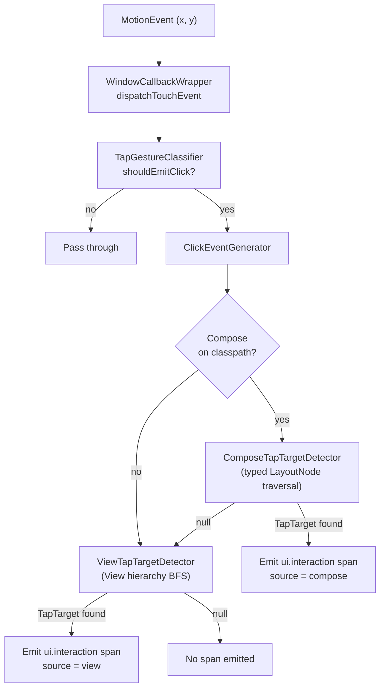
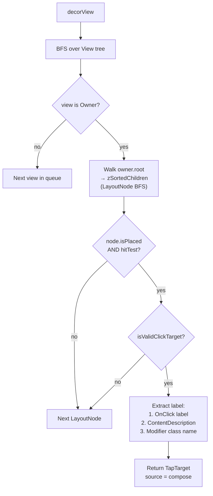
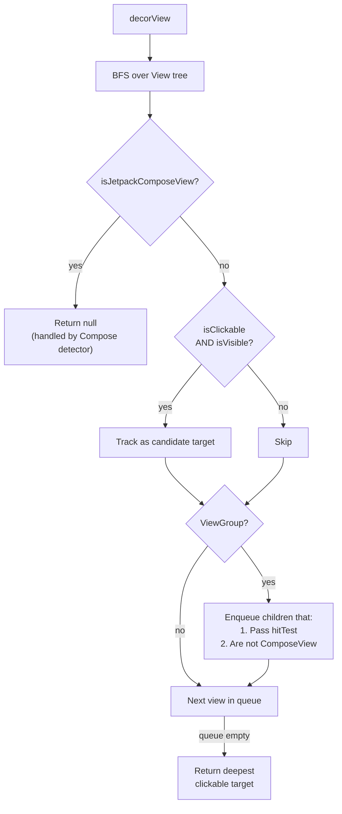

# hybrid-click — Design Document

**Author:** Ashish Zingade

## Purpose

`hybrid-click` captures tap/click interactions from Android apps that use **View-based UI**,
**Jetpack Compose UI**, or **both** within the same screen. Each qualified tap produces a single
OpenTelemetry `ui.interaction` span with metadata identifying the tapped widget and which UI framework
rendered it.

This is distinct from the `view-click` and `compose-click` modules, which each handle only
one framework. `hybrid-click` combines both detection paths behind a single instrumentation
entry point.

---

## Architecture Overview

```
┌──────────────────────────────────────────────────────────────────┐
│                    HybridClickInstrumentation                    │
│               (AutoService entry point, installs on app start)   │
│                                                                  │
│  Registers ClickActivityCallback with Application lifecycle      │
└──────────────────────┬───────────────────────────────────────────┘
                       │
                       ▼
┌──────────────────────────────────────────────────────────────────┐
│                    ClickActivityCallback                         │
│                                                                  │
│  onActivityResumed → ClickEventGenerator.startTracking(window)   │
│  onActivityPaused  → ClickEventGenerator.stopTracking()          │
└──────────────────────┬───────────────────────────────────────────┘
                       │
                       ▼
┌──────────────────────────────────────────────────────────────────┐
│                    WindowCallbackWrapper                          │
│                                                                  │
│  Wraps Window.Callback via delegation                            │
│  dispatchTouchEvent → ClickEventGenerator.generateClick(event)   │
│                       then delegates to original callback        │
└──────────────────────┬───────────────────────────────────────────┘
                       │
                       ▼
┌──────────────────────────────────────────────────────────────────┐
│                    ClickEventGenerator (orchestrator)             │
│                                                                  │
│  1. TapGestureClassifier gates non-tap gestures                  │
│  2. Compose detector first (if Compose on classpath)             │
│  3. View detector as fallback                                    │
│  4. Emit ui.interaction span with attributes                           │
└──────────────────────────────────────────────────────────────────┘
```

---

## Runtime Flow



**Key decision**: Compose is always tried first. If the tap lands on a Compose surface
(`AndroidComposeView` / `Owner`), it returns a `TapTarget` immediately. If Compose is not
present or returns `null`, the View detector takes over. This ensures no double-counting
when a `ComposeView` is embedded inside a View hierarchy.

---

## Module Structure

```
hybrid-click/src/main/kotlin/.../hybrid/click/
│
├── HybridClickInstrumentation.kt    Entry point (AutoService)
├── ClickActivityCallback.kt         Activity lifecycle → window tracking
├── ClickEventGenerator.kt           Orchestrator: classify → detect → emit
├── WindowCallbackWrapper.kt         Touch event interception
│
├── compose/
│   ├── ComposeTapTargetDetector.kt   Typed LayoutNode/Owner traversal
│   └── ComposeLayoutNodeUtil.kt      Bounds & position from LayoutNode
│
├── view/
│   └── ViewTapTargetDetector.kt      View hierarchy BFS traversal
│
└── shared/
    ├── TapTarget.kt                  Normalized click target data
    ├── TapGestureClassifier.kt       Down→Move→Up tap detection
    ├── LabelResolver.kt              Best-effort display label resolution
    └── SemConvConstants.kt           OpenTelemetry attribute keys
```

---

## Compose Detection Path



### Compose Internals Access

The Compose detector uses `@file:Suppress("INVISIBLE_MEMBER", "INVISIBLE_REFERENCE")` to
access internal Compose APIs (`LayoutNode`, `Owner`, `SemanticsModifier`, etc.). This is the
same pattern used by the `compose-click` module. Classes are annotated with `@RequiresApi(24)`
to exclude them from AnimalSniffer validation.

### Click Target Validation

A `LayoutNode` is considered a valid click target if any of its modifiers:
- Is a `SemanticsModifier` whose `SemanticsConfiguration` contains `SemanticsActions.OnClick`
- Has a qualified class name matching one of the foundation clickable elements:
  - `androidx.compose.foundation.ClickableElement`
  - `androidx.compose.foundation.CombinedClickableElement`
  - `androidx.compose.foundation.selection.ToggleableElement`

### Label Extraction Precedence

1. `SemanticsActions.OnClick` → `AccessibilityAction.label` (e.g., "Pay now")
2. `SemanticsProperties.ContentDescription[0]` (e.g., "Help button")
3. Last modifier's `qualifiedName` (e.g., "ClickableElement")
4. `LabelResolver` fallback using `node.hashCode()` as last resort

---

## View Detection Path



### List and grid rows

An `AdapterView` — `ListView`, `GridView` — marks **itself** clickable and dispatches item clicks
internally, so its rows are not clickable. Without special handling the deepest clickable target for
a tap anywhere in a list is the list container, which means every row in a list resolves to the same
target: same id, same type, and a label taken from whichever row came first in the descendant search
regardless of which row was tapped.

That is wrong in a way worth spelling out, because it does not look wrong: the label is a real string
from a real row, so nothing about the span suggests it is misattributed. In a list of transactions or
contacts, the first row's text — often personal data — ends up stamped on every tap in that list.

Rows of an `AdapterView` are therefore treated as valid tap targets, the same "not clickable, but
genuinely the thing tapped" exception already made for `EditText`. Resolving the row instead of the
container fixes identity as well as the label, which a label-only fix would not.

`AbsSpinner` is excluded: a spinner's single child is its *selected* item's view, not a row, so the
spinner itself stays the target. A spinner's actual options live in a `PopupWindow` this module
cannot see at all (see *Window Tracking → Not covered*).

`RecyclerView` is unaffected — its rows normally receive click listeners from the adapter, so they
are already clickable and already resolve correctly.

#### Calendar controls

Every control inside a Material calendar names a date through its accessibility label, so resolving
any of them normally would put the date a user is choosing straight onto the wire:

| tapped | natural label | reported instead |
|---|---|---|
| day cell | `Friday, September 4` | `calendar day` |
| month/year navigation button | `September 2026` | `calendar month` |
| year cell in the year picker | `Navigate to year 2030` | `calendar year` |

This is the same treatment a password field gets: when a widget's natural label is the sensitive
value itself, it is replaced rather than sanitized. The interaction is still reported — only the date
is withheld. Which day was ultimately chosen is carried when the picker is confirmed, as a relative
day offset.

How each is recognized, none of which requires depending on `com.google.android.material`:

- **Day cell** — its parent's qualified name is `MaterialCalendarGridView`, matched the same way
  `SwitchCompat`/`MaterialSwitch` and the Material slider already are.
- **Month button** — its own resource entry *name* is `month_navigation_fragment_toggle`. The id is a
  private Material resource, but the name is readable via `getResourceEntryName`.
- **Year cell** — an ancestor's resource entry name is `mtrl_calendar_year_selector_frame`. Year cells
  have no id of their own and are ordinary `TextView`s using the *same* Material style as day cells,
  so they are indistinguishable in isolation and must be identified by their container.

The suppression is deliberately narrow: an app button whose text merely reads like a month keeps its
own label, and ordinary list rows keep theirs — those labels are the reason click telemetry is useful
at all.

**Known limits.** The three anchors are undocumented Material internals; if any is renamed the
corresponding suppression stops silently and that date resurfaces. The values are pinned by a
contract test so *our* changing them is deliberate, but a Material rename can only be caught by
re-checking against a real picker. The year anchor exists only in Material's horizontal calendar
layout, which is what the dialog uses; a variant without that frame would not match. And the
month/year rules are verified against a real picker on device rather than by unit test, because
Material's private resource names cannot be synthesized in this module's tests — inventing ids there
would test the stand-in rather than the rule.

### Compose Boundary Gating

The View detector recognizes Compose host views by checking if the class name starts with
`"androidx.compose.ui.platform.ComposeView"`. When encountered:
- At the top level: returns `null` immediately
- As a child: excluded from the BFS queue

This prevents double-detection — the Compose detector has already handled anything inside a
`ComposeView`.

### Label Resolution for Views

`LabelResolver` produces a human-readable label using this priority:
1. `view.contentDescription` (accessibility label set by developer)
2. `(view as? TextView).text` (visible text content)
3. `view.javaClass.simpleName` (class name like "Button", "ImageView")
4. `view.id.toString()` (numeric resource ID as last resort)

---

## Span Output

Every qualified tap produces one `ui.interaction` span with these attributes:

| Attribute                     | Source                                       | Example              |
|-------------------------------|----------------------------------------------|----------------------|
| `app.widget.id`               | Node hashCode (Compose) or View ID           | `"2131231045"`       |
| `app.widget.name`             | Best-effort display label                    | `"Pay now"`          |
| `app.screen.coordinate.x`     | Tap X position in window                     | `250`                |
| `app.screen.coordinate.y`     | Tap Y position in window                     | `480`                |
| `app.widget.source`           | UI framework: `"compose"` or `"view"`        | `"compose"`          |
| `app.widget.type`             | Widget kind (button/switch/text_field/…)     | `"button"`           |
| `ui.control.type`             | Same value as `app.widget.type` — canonical name | `"button"`       |
| `interaction.type`            | Semantic interaction kind                    | `"toggle"`           |
| `ui.gesture.type`             | Raw pointer gesture: `"tap"`, `"long_press"`, `"drag"` | `"drag"`   |
| `ui.control.selection_mode`   | `"single"`/`"multiple"` — **selection widgets only** | `"multiple"` |
| `ui.control.value.checked`    | Toggle state — **toggle widgets only**       | `true`               |
| `ui.control.value.value`      | Slider position, % of range — **range controls only** | `25.0`      |
| `ui.control.value.selected_date` | Date chosen, day offset from today — **date pickers only** | `-30` |
| `ui.control.value.start_date` / `.end_date` | Chosen range ends, day offsets — **range date pickers only** | `-30` / `0` |

The span ends immediately after the tap (or after the toggle-state read for `CompoundButton`).
`ActiveInteractionContext` separately remains current for `activeContextWindowMillis`
(configurable via `setActiveContextWindowMillis`) so downstream async work can still parent
to the click. The configured window controls the parenting window, not the span duration.

### `app.widget.type`

A normalized widget kind so clicks can be grouped/queried by element type. Values:
`button`, `switch`, `checkbox`, `radio`, `toggle`, `text_field`, `image`, `tab`, `dropdown`,
`text`, `view`, `unknown`.

- **View** — derived from the widget class (`Button`/`ImageButton` → `button`, `CompoundButton`
  subtypes → `switch`/`checkbox`/`radio`/`toggle`, `EditText` → `text_field`, etc.).
- **Compose** — derived primarily from the semantics `Role` (`Role.Button`, `Role.Switch`,
  `Role.Checkbox`, `Role.RadioButton`, `Role.Tab`, …), falling back to `SetText` → `text_field` and
  `OnClick` → `button`.

### `ui.control.type`

Canonical successor to `app.widget.type`, carrying the identical value. Canonical treats
`app.widget.type` as an Android wire-format key and prefers this name; both are emitted so
existing `app.widget.type` queries keep working unchanged.

### `ui.control.selection_mode`

Whether the tapped control belongs to a single-choice group (`"single"`) or is independently
toggleable (`"multiple"`), derived from `app.widget.type` / `ui.control.type` — see
`resolveSelectionMode`:

| Widget kind                     | Selection mode |
|----------------------------------|----------------|
| `radio`, `tab`, `dropdown`       | `single`       |
| `switch`, `checkbox`, `toggle`   | `multiple`     |
| everything else                  | *(omitted)*    |

The mapping follows ordinary Android/Compose semantics for the widget **kind**, not the
per-instance UI: a `radio` is `single` because that's what a radio button means, without checking
whether it actually sits inside a `RadioGroup`. Omitted entirely for kinds where the concept
doesn't apply (buttons, text, images, unknown) rather than emitted as some default value.

### `interaction.type`

The **semantic** interaction the user performed, derived from the control that was hit and falling
back to the raw gesture when the control implies no interaction of its own — see
`resolveInteractionType`:

| Widget kind                              | `interaction.type`          |
|------------------------------------------|-----------------------------|
| `switch`, `checkbox`, `radio`, `toggle`  | `toggle`                    |
| `slider`                                 | `slider`                    |
| everything else                          | `tap` / `long_press`        |

A detector may also supply the kind outright, via `TapTarget.interactionKind`, which wins over the
table above. That exists for interactions the widget kind cannot reveal — a date picker's confirm
button is an ordinary button, and only the detector can see the picker around it. See *Date pickers*.

The control is consulted first because the interaction is not recoverable from the gesture alone:
the identical tap is a plain tap on a button but a toggle on a switch. iOS reports the semantic
kind, so deriving it here is what lets both platforms be grouped by this one attribute. The gesture
itself is never lost — it stays on `ui.gesture.type`, so a long-pressed checkbox reports
`interaction.type = toggle` alongside `ui.gesture.type = long_press`.

The toggle set matches `ActionSummarizer.TOGGLE_TYPES` in `core`, which already treats exactly
these four kinds as toggles.

**`tab` and `dropdown` are deliberately not mapped.** They are single-choice for
`ui.control.selection_mode`'s purposes, but selecting from them is canonical's `menu_select`, which
this module cannot detect — a dropdown's options live in a `PopupWindow`, which has no
`Window.Callback` to wrap (see *Window Tracking → Not covered*). They keep reporting the gesture
rather than claiming an interaction that was never observed.

**Not yet reachable.** Canonical also defines `value_changed` and `menu_select`. Neither is emitted
today — see *Window Tracking → Not covered* for the surfaces involved.

Both come from the same qualified gesture — one that reaches `ACTION_UP` without leaving the touch
slop — split by how long the pointer was down, measured against
`ViewConfiguration.getLongPressTimeout()`. A gesture that leaves the slop is not reported at all,
so a slow drag is neither a tap nor a long press.

The kind therefore describes **the gesture the user performed, not necessarily the one the app
acted on**. Android fires `onLongClick` at the timeout while the finger is still down and then
suppresses the click, but only for targets that actually handle long clicks; a slow press on an
ordinary button is reported as `long_press` even though the app treated it as a normal click.

**Known limits of the vocabulary.** Only these two kinds are detectable today. The classifier
tracks a single pointer, so `ACTION_POINTER_DOWN` does not disqualify a gesture and a two-finger
pinch whose primary finger stays still is still reported as a `tap`. Double-tap is not detectable
at all: it needs cross-gesture state or `GestureDetector`, whose deferred `onSingleTapConfirmed`
would break the synchronous emission this module depends on (see *Tap Gesture Classification*).

### `ui.gesture.type`

The raw pointer gesture, always emitted. Values: `tap`, `long_press`, `drag` (see `GestureType`). It
equals `interaction.type` only when the control implies no interaction of its own; on a toggle or a
slider the two differ.

The two keys are separate contracts because they answer different questions. `ui.gesture.type` is
always "what did the finger do". `interaction.type` names the *semantic* interaction, and so depends
on which control was hit — the same tap is a plain tap on a button but a toggle on a switch. Keeping
the gesture on its own key means gesture-level analysis (tap vs long-press rates, for instance)
keeps working unchanged now that `interaction.type` reports control-derived kinds.

Named `ui.gesture.type`, not `app.gesture.type`: `app.*` here is a legacy platform wire prefix that
canonical treats as Android-specific (see `ui.control.type` above), so a new key does not adopt it.

### `ui.control.value.checked`

Emitted only when the tapped target is a genuine toggle — an `android.widget.CompoundButton`
(`Switch`, `MaterialSwitch`, `CheckBox`, `RadioButton`, `ToggleButton`) or a `CheckedTextView`. It
is **not** keyed off the `Checkable` interface, because `MaterialButton` implements `Checkable`
while being an ordinary button (that would tag every Material button, e.g. a dialog's "OK", with
`checked=false`).

The state is read on a deferred main-loop tick rather than inline: a `CompoundButton` flips in
`PerformClick`, which `View.onTouchEvent` *posts* on `ACTION_UP`, so the resulting (post-tap) state
is only observable after that runnable runs. The span ends after the read so the attribute is
always recorded before the span closes; `ActiveInteractionContext` stays current independently
for `activeContextWindowMillis`.

**View only.** Compose toggles currently do not emit `ui.control.value.checked` — Compose state
updates on recomposition (asynchronously), so a reliable post-tap read isn't available through
this path.

---

## Range controls

Sliders are captured on both paths: `SeekBar`, `AppCompatSeekBar`, a user-seekable `RatingBar` and
Material's `Slider`/`RangeSlider` on the View side, and Compose's `Slider` (see *Compose sliders*
below).

Before this, a `SeekBar` produced **no span at all** — not for a drag, and not for a tap either. Two
independent reasons:

1. `SeekBar` is not `clickable` by default (nothing in `ProgressBar → AbsSeekBar → SeekBar` sets it,
   and no default style does), so the detector's `isClickable` gate rejected it outright.
2. A drag leaves the touch slop, and the gesture classifier discarded such gestures entirely.

Both are now handled: `isValidClickTarget` admits user-seekable `AbsSeekBar`s alongside `EditText`,
and `TapGestureClassifier` reports `GestureType.DRAG` rather than swallowing movement.

### What counts, and what deliberately does not

| Class                                  | Counts | Why |
|----------------------------------------|--------|-----|
| `SeekBar`, `AppCompatSeekBar`          | yes    | matched via `AbsSeekBar` |
| `RatingBar`                            | yes    | extends `AbsSeekBar` **directly**, so matching `SeekBar` would miss it |
| `RatingBar` with `isIndicator`          | no     | `setIsIndicator` clears `mIsUserSeekable`; `onTouchEvent` then refuses the touch |
| `ProgressBar`                          | no     | `AbsSeekBar`'s superclass — an indicator, not a control |
| Material `Slider` / `RangeSlider`      | yes    | matched by the qualified name of `BaseSlider` |

Material sliders are matched **by name** because this module must not depend on
`com.google.android.material` — the same constraint behind the `SwitchCompat`/`MaterialSwitch` name
match. Note Material's slider *is* `setClickable(true)` in its constructor, so it already reached
this detector before slider support existed, reported as a plain `view`; its taps therefore change
type from `view` to `slider`.

### Drag handling

A drag resolves its target at the point the finger went **down**, not up: a slider drag routinely
ends outside the control's own bounds. Resolution runs only for drags, so an ordinary tap pays
nothing for it.

Two guards keep the path honest:

- The down-target must be a `slider`. Every scroll and fling in the app reaches this code, and
  without the check each one would emit a span.
- The control must have been actively tracking the gesture (`View.isPressed`, which `startDrag` sets
  and `ACTION_CANCEL` clears). A slider inside a `RecyclerView` loses the gesture to its parent —
  it gets `ACTION_CANCEL` and never seeks — while the window callback still sees the whole
  `DOWN`…`UP` stream, which would otherwise report a value that never changed.

`ActiveInteractionContext` is deliberately **not** cleared on the drag path. Clearing it there would
wipe the active click context on every scroll: tap "Pay", then flick the screen while the request is
in flight, and downstream spans would stop parenting to the click.

### `ui.control.value.value`

The slider's position as a **percentage (0–100) of its own range**, rounded to 2 dp — never the
underlying value.

**Privacy guarantee.** On a BFSI amount slider the raw number is user-entered financial data, and
this module's standing rule is that such values are excluded rather than sanitized (see *Text
fields* below). A percentage keeps the interaction analytically useful — how far along its range the
user pushed the control — without putting the amount on the wire. Note this means the attribute is
**not** directly comparable with a platform that reports the raw value.

The value is read on a deferred main-loop tick, like the toggle state, because the widget has not
processed the gesture when the span is built. It is not optional: for a tap-seek `AbsSeekBar` calls
`trackTouchEvent` only at `ACTION_UP`, so a synchronous read would report the pre-tap position every
time.

`min` is treated as `0` rather than read from `getMin()`, which is API 26 against this module's
`minSdk` of 23. `ProgressBar` initializes `mMin = 0` and offered no API to change it before 26, so
this is only inexact for an app setting `android:min` on API 26+ — not worth an API guard.

A `RangeSlider` emits `ui.control.type = slider` but **no** value: it has no single position, only
`getValues()`.

### Compose sliders

A Compose `Slider` has **no `Role`** — Compose defines none for sliders — and exposes no `OnClick`
and none of the matched foundation elements, since it is built from `draggable` +
`detectTapGestures`. It is therefore identified solely by the `SemanticsActions.SetProgress` action
it carries, which is now admitted alongside `OnClick` and `SetText` in both
`collectTappableSemanticsIds` and `isValidClickTarget`.

Detection keys on the `SetProgress` **action**, deliberately not on
`SemanticsProperties.ProgressBarRangeInfo`: `Modifier.progressSemantics` also puts that info on
`LinearProgressIndicator`/`CircularProgressIndicator`, which are non-interactive. That is the exact
Compose analogue of excluding `ProgressBar` on the View path.

**The value is read synchronously, not deferred.** A Compose control's value only reaches its
semantics after a composition pass, and composition runs on a *frame* boundary rather than a
*message* boundary, so posting to the main looper — the mechanism the View path relies on — cannot
reliably observe it. The value is therefore snapshotted before the gesture is delivered, which
`TapTarget.valueIsPreGesture` records. Consequences:

- For a **drag**, the snapshot trails the final position by at most one frame of movement, because
  the preceding `ACTION_MOVE`s have already been delivered and recomposed. It is emitted.
- For a **tap-seek**, nothing has been processed yet, so the snapshot is the pre-tap value outright.
  It is **omitted** — reporting it would put a number on the wire the user never selected.

Either way `interaction.type = slider` and `ui.control.type = slider` are reported, since those come
from the synchronous type resolution and need no value read at all.

The reader reaches the detector through the same reflection bridge as `nodeToType`, resolved
leniently: a detector build without `nodeToNormalizedValue` loses the value attribute rather than
disabling all Compose click detection.

## Date pickers

A Material date picker's confirm tap reports `interaction.type = date_picker` and what was chosen.

`MaterialDatePicker` is a `DialogFragment`, so its window is already tracked and **the confirm tap
already produced a span before this existed** — an anonymous `button` labelled with a localized
"OK". Nothing needed intercepting; the tap only needed recognizing.

`ui.control.type` deliberately stays `button`. The tapped widget really is a confirm button, and
leaving it alone means nothing keyed on `ui.control.type` shifts. Consumers filter date picking on
`interaction.type`, which is what the discriminator is for.

### Recognition

Two stages, cheapest first — the tag check is a field read, so ordinary taps pay nothing:

1. `view.tag == "CONFIRM_BUTTON_TAG"`.
2. `FragmentManager.findFragment(view)`, then the owner must expose a public no-arg `getSelection()`.

The tag is matched as a **string literal**. `MaterialDatePicker.CONFIRM_BUTTON_TAG` is
package-private and typed `Object` but holds exactly that interned string, so this needs no
dependency on `com.google.android.material` — which this module does not have. It does couple us to
an undocumented internal, so the literal is pinned by a wire-key test; a rename shows up as a
failing test rather than as telemetry that silently stops.

Matching on the button's resource-id name (`confirm_button`) was rejected: apps commonly define an
id by that name themselves, so it would misreport ordinary buttons.

The owner is **duck-typed** on `getSelection()` rather than matched on `MaterialDatePicker`'s
qualified name. That covers app subclasses for free, and keeps the logic unit-testable — Material
cannot be a test dependency here, so a name-matched implementation could not be tested at all.

### `ui.control.value.selected_date` / `.start_date` / `.end_date`

Whole-day offsets from today, negative for the past — never an absolute date.

**Privacy guarantee.** A chosen date is user-entered data, and this module excludes such values
rather than sanitizing them (see *Text fields*). An offset still answers what a statement or booking
flow wants to know — how far back or forward people reach — without putting the date on the wire.
The range *length*, usually the more interesting figure, is `end - start` and needs no key of its
own. Note this means the attributes are **not** directly comparable with a platform reporting
absolute dates.

`getSelection()` returns UTC-midnight millis: a `Long` for a single date, a pair for a range, or
`null` before anything is chosen. That runtime type is the only way to tell single from range —
`getDateSelector()` is private, and `getInputMode()` distinguishes calendar from keyboard entry, not
arity. Either end of a range may be absent, since a range picker can be confirmed half-open.

The value is captured **synchronously**, unlike the toggle and slider reads. The date was chosen
long before the confirm tap, so it is already final, and a deferred read could arrive after the
dialog has torn its fragment down. It is deliberately not flagged `valueIsPreGesture` — that flag
means "stale for a tap", and this value is not stale: the confirm tap does not change it.

The day arithmetic reduces both sides to an epoch-day number and subtracts, so it needs no
`Calendar`, no formatter and no timezone handling — which also keeps it clear of `java.time`,
unavailable here because core library desugaring is not enabled for library modules. The floor is
done by hand because integer division rounds toward zero, which would put a pre-1970 date — an
ordinary birth date — a day late, and `Math.floorDiv` is API 24 against a `minSdk` of 23.

### Not covered

- **The framework's `android.app.DatePickerDialog`**, which extends `AlertDialog` — a raw dialog with
  no discoverable window (see *Window Tracking → Not covered*). An app using it emits nothing.
- **Compose date pickers.** An inline `DatePicker` sits in a tracked window, but a Compose
  `DatePickerDialog` renders in its own non-`DialogFragment` window, and reading a Compose selection
  hits the composition/frame-boundary problem described under *Compose sliders*.
- **`MaterialTimePicker`.** Also a `DialogFragment`, but it sets no button tag at all, so it needs a
  different identification strategy — and canonical defines no `time_picker` value, so reporting a
  time as `date_picker` would be wrong.

## Text fields

Tapping a text field is captured as a `ui.interaction`, identified by its **label** — never its contents.

- **View** (`EditText`): a stock `EditText` is focusable but **not** clickable, so the detector
  treats `EditText` itself as a valid tap target (alongside `isClickable` views). Its label resolves
  as `contentDescription → hint → class name`; the typed `text` is **never** used, and password
  `inputType` fields fall back to a constant.
- **Compose** (`TextField`/`OutlinedTextField`): these expose no `OnClick` and, in modern Compose,
  no legacy `SemanticsModifier`, so they are detected via the **semantics tree** — a node carrying a
  `SemanticsActions.SetText` action. The label prefers the field's `Text` (its label) over any
  merged `ContentDescription` (usually a decorative leading icon such as "Phone"/"Lock").

**Privacy guarantee.** The entered value is never emitted. On the Compose path the typed value
(`SemanticsProperties.EditableText`) is read *only* to exclude matching candidates, and — because a
`VisualTransformation` (card/phone/currency masking) makes the displayed `Text` differ from the raw
value and bypass that check — the field's `Text` is used as a label **only when the field is empty**
(when it is the label/placeholder, never input). Fields flagged `SemanticsProperties.Password` fall
back to a constant label. Note that
`app.widget.name` is still derived from visible labels/text generally, which in some apps can be
dynamic data; deployments with strict data-handling requirements should review what their labels
contain.

---

## Window Tracking

A tap is only seen if the window it lands in has its `Window.Callback` wrapped. `hybrid-click`
tracks multiple windows simultaneously (the Activity window plus any dialogs stacked on it); each
tracked window keeps its own `TapGestureClassifier`, keyed by `Window` in a `WeakHashMap`.

Windows are discovered two ways:

1. **Activity windows** — `ClickActivityCallback` wraps `activity.window` on resume / unwraps on
   pause.
2. **DialogFragment windows** — `DialogFragmentClickCallback` (a `FragmentManager
   .FragmentLifecycleCallbacks` registered per Activity) wraps `dialog.window` on fragment resume.
   `androidx.fragment` is a `compileOnly` dependency; registration is guarded and lazily initialized
   so apps without fragments neither crash nor pay for it.

Both mechanisms use only public SDK APIs, which keeps the module safe for security-sensitive
deployments (no reflection into framework internals).

### Not covered

- **Raw dialogs** shown directly via `AlertDialog.Builder(...).show()` (i.e. not hosted in a
  `DialogFragment`). They own a separate `Window`, but Android exposes no public, lifecycle-based
  hook to discover them — the only known mechanisms reach into hidden framework internals
  (`WindowManagerGlobal`/`DecorView`), which is intentionally avoided here. Apps that need these
  captured should host them in a `DialogFragment`.
- **`PopupWindow`-based surfaces** (overflow/`PopupMenu`, `Spinner` dropdowns). Their root views are
  not decor views and have no `Window`/`Window.Callback` to wrap.

---

## Tap Gesture Classification

`TapGestureClassifier` filters raw `MotionEvent` sequences into qualified gestures and reports
which kind each one was:

```
ACTION_DOWN → record (x, y) and event time, start tracking
ACTION_MOVE → if distance > touchSlop, disqualify
ACTION_UP   → if still within slop, classify by press duration:
                 held ≥ longPressTimeout → long_press
                 otherwise               → tap
ACTION_CANCEL → reset
```

`touchSlopPx` is initialized from `ViewConfiguration.get(context).scaledTouchSlop` and
`longPressTimeoutMs` from `ViewConfiguration.getLongPressTimeout()` when tracking starts, matching
the system's standard thresholds. Both have plain constant fallbacks so the classifier stays usable
in non-Robolectric unit tests, where real `ViewConfiguration` calls are not available.

Duration is taken from `MotionEvent.getEventTime()`, so classification stays on the same monotonic
clock the platform uses and needs no injected time source. Deciding the kind at `ACTION_UP` — rather
than firing at the timeout the way `GestureDetector` does — is what keeps emission synchronous
inside `dispatchTouchEvent`, which `ActiveInteractionContext` and the `CompoundButton` state read
both depend on.

---

## Mixed UI Example

Consider a screen with a traditional `Toolbar` (View) at the top and a Compose `LazyColumn`
in the body:

```
┌─────────────────────────────┐
│  Toolbar (View)             │  ← View detector handles taps here
│  [Back] [Title] [Settings]  │
├─────────────────────────────┤
│  ComposeView                │
│  ┌─────────────────────┐   │
│  │  LazyColumn          │   │
│  │  ┌─────────────┐    │   │  ← Compose detector handles taps here
│  │  │  Card("Item")│    │   │    label = "Item", source = "compose"
│  │  └─────────────┘    │   │
│  │  ┌─────────────┐    │   │
│  │  │  Button      │    │   │
│  │  │  ("Pay now") │    │   │  ← Compose detector: label = "Pay now"
│  │  └─────────────┘    │   │
│  └─────────────────────┘   │
└─────────────────────────────┘
```

- Tap on **Back button** → View detector finds clickable `ImageButton`, emits span with
  `source = "view"`, `label = "Navigate up"`
- Tap on **"Pay now" button** → Compose detector finds `LayoutNode` with
  `SemanticsActions.OnClick(label = "Pay now")`, emits span with `source = "compose"`,
  `label = "Pay now"`

---

## Key Design Decisions

1. **Compose-first detection**: Compose detector runs before the View detector. If Compose
   claims the tap, the View detector is never called. This avoids double-counting for
   `ComposeView` hosts embedded in View hierarchies.

2. **Lazy Compose initialization**: `ComposeTapTargetDetector` is created lazily and only if
   `Class.forName("androidx.compose.ui.platform.ComposeView")` succeeds. Pure-View apps
   pay zero overhead for the Compose path.

3. **No reflection in the detection path**: The Compose detector uses typed
   `LayoutNode`/`Owner` APIs via Kotlin visibility suppressions, not Java reflection. This
   is faster, type-safe, and produces cleaner bytecode.

4. **Rich labels via LabelResolver**: Unlike `view-click` which uses simple class names,
   `hybrid-click` uses `LabelResolver` for both paths to produce developer-friendly labels
   from accessibility metadata, text content, and class names.

5. **Single span per tap**: Regardless of which detector finds the target, exactly one
   `ui.interaction` span is emitted with a `view.source` attribute to distinguish the framework.

---

## Relationship to Other Modules

| Module          | Scope                     | When to use                                   |
|-----------------|---------------------------|-----------------------------------------------|
| `view-click`    | View-only apps            | App uses only XML/View-based UI               |
| `compose-click` | Compose-only apps         | App uses only Jetpack Compose                 |
| `hybrid-click`  | Mixed View + Compose apps | App uses both frameworks on the same screen   |

`hybrid-click` intentionally mirrors the detection patterns of both `compose-click` (typed
`LayoutNode` traversal) and `view-click` (View hierarchy BFS), combining them behind the
orchestrator with a shared `TapTarget` model.
